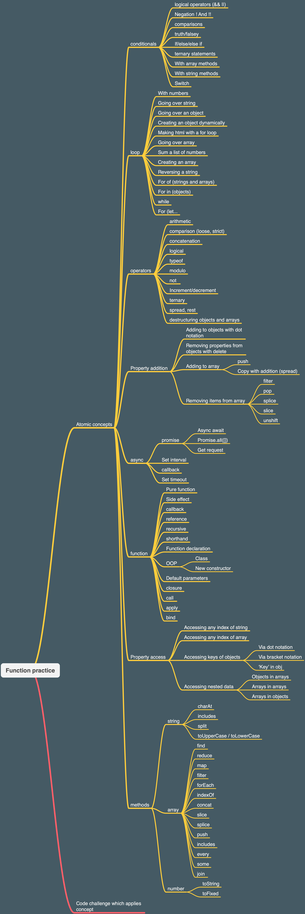

# This repo is for testing comprehension of two fundamental concepts

## This repo currently is for js only (but could apply deeper to other material as well such as react, css, etc)

### The JS Portions

- note this is core fundamentals and currently doesnt support async

0. Variables
1. Data access / modification
2. Operators
3. Conditionals
4. Loops
5. Functions
6. Methods

#### For each fundamental - there is a dichotomy (both sub folders)

1. Atomics (the indivisible truisms of coding)
2. Practical (taking one or more concepts and synthesizing a solution)

##### Let's see an example (with operators)

- first is the principle of atomics

```js
const foo = 'hello'

// check that foo is the string 'hello' by comparison
// store the result in the variable below
const isHello = null

console.assert(isHello)
```

- the answer we would be looking for here is as follows:
- obviously they could have done this another way
- the focus is strictly on operators however

```js
const foo = 'hello'

// check that foo is the string 'hello' by comparison
// store the result in the variable below
const isHello = foo == 'hello'

console.assert(isHello)
```

- next would be a principle of a practical example
- note that we are using functions here to test despite it being a concept further down the line (since it doesn't seem very practical to write one off code)

```js
// write a function "atLeastFive" which checks that a string is at least 5 characters

console.assert(atLeastFive('foo') == false)
console.assert(atLeastFive('hello') == true)
```

- the answer could be as follows

```js
// write a function "atLeastFive" which checks that a string is at least 5 characters

function atLeastFive(str) {
    return str.length >= 5
}

console.assert(atLeastFive('foo') == false)
console.assert(atLeastFive('hello') == true)
```

### an additional note on practical examples
- practical examples have the nuance of needing to synthesize mutiple concepts together by necessity (IE reversing a string)
- atomics are noted in comments

```js
// idea of a function
function reverseString(str) {
    // idea of variable initialization
    let newString = ''
    // idea of property access on string
    // idea of loop
    for (let i = str.length - 1; i >= 0; i--) {
        newString = newString + str[i]
    }
    return newString
}
console.assert(reverseString('hello') === 'olleh)
```

### an additional note about both

- Each of these different fundamentals should operate on two types of data
- Note this is not all inclusive - just an example of both types
1. primitives: strings, boolean, number
2. non-primitive (compound values...): objects and arrays

### Bird's eye



#### some existing material to pull from

- note that these use jest or mocha or something
- we are using console.assert strictly

https://codepen.io/collection/XJrMxG

https://github.com/punchcode-fullstack/teacher-function-olympics/tree/master/tests/atomic