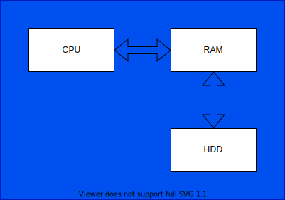

## 8086 Architecture (20 min)

- explain why the parts exist as they do
- discuss persistent storage (magentic, optical)
- add an 8 bit bus to the drawing
  - explain +5v is high(1), +3v is low(0)
  - draw 1s and 0s along the bus
- explain how the 1s and 0s can represent data
- explain the clock

### workshop (10 min)
- draw the basic 8086 architecture
- explain to each other what happens to contents in RAM when power is cut and how this problem can be solved
