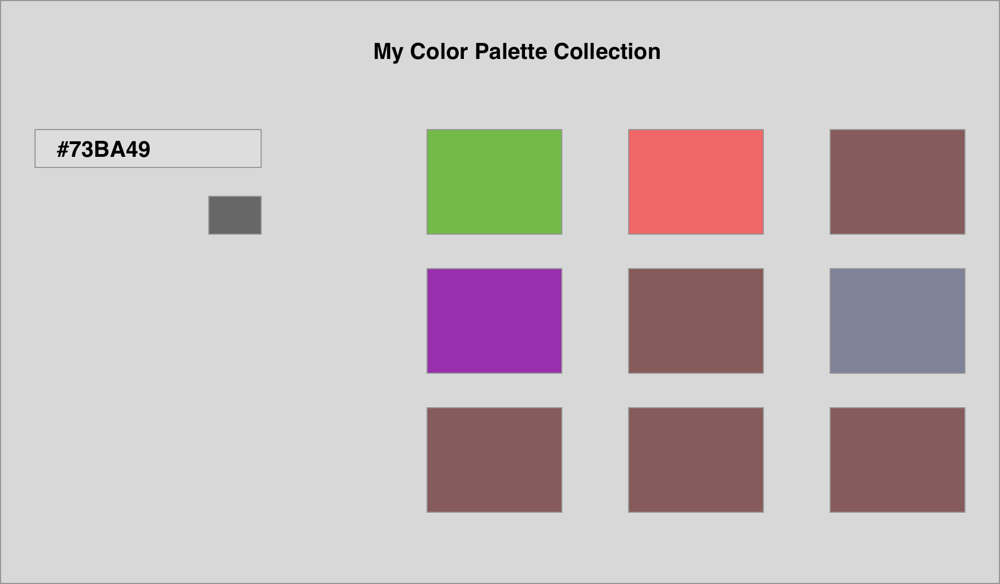

# To install

```bash
yarn install
```
# To run

```bash
yarn start
```

### Components can be placed in the components folder

## make a HelloWord component...

h2 of "Hello World"

## make a greet component that takes the user and displays their name

"Hello" name


## Make a button1 component - setState
    setState count

## Mak a button2 component (set state) - useEffect
    when number reaches 5
    alert('hello')

## Make a card component that takes a user

and displays a telephone number as a p tag

if it exists (otherwise show "N/A")

it should use everything from the user
IE: image, name, phone number (if applicable)

## Form color palette component

type in an input and hit enter (form submit)
it should make a box (another component) appear on the page
with whatever color you put in the input (using a style object for the box for color)

## color palette app (use context)

please use the todo folder as a guide to make this app

### Normal Mode

Add Mode (on submit of the form)

using this input that submits a color

make a list of boxes that track each color


#### Hard Mode below (warning - may need to change how you represent the palette color)

##### Add/Edit Mode

If you click on a palette color,
fill the input with the color that was selected
on submit of the form,
replace the current color with that color

when submitting (put it back into "Add Mode")




