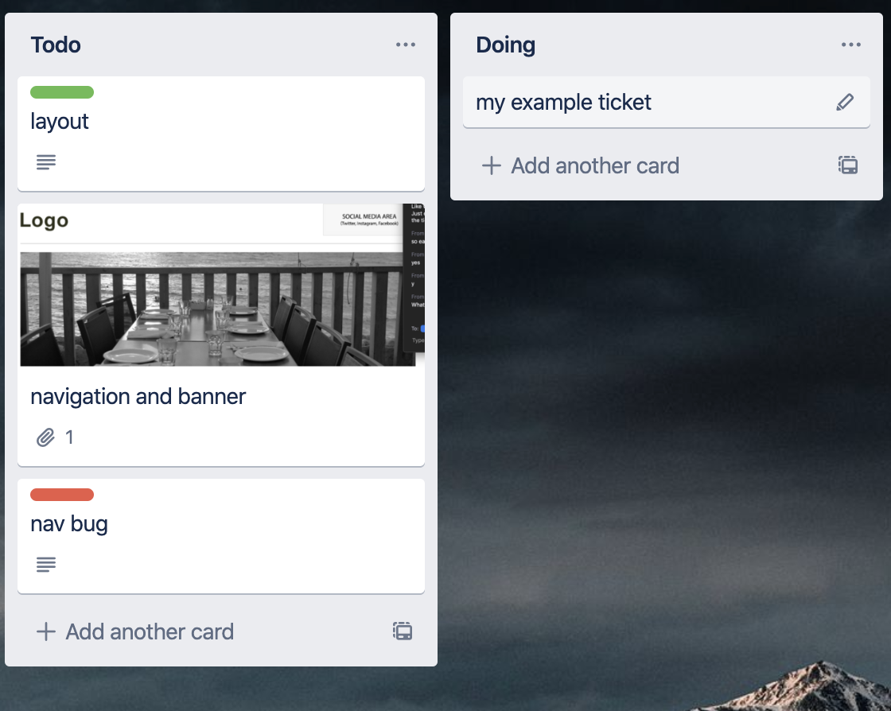
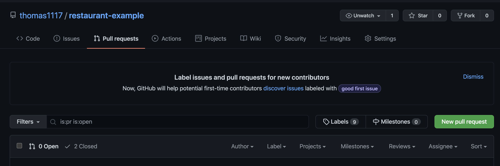
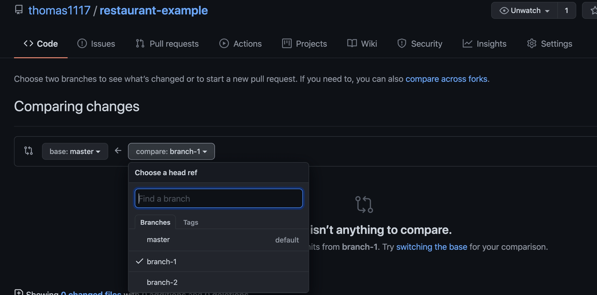
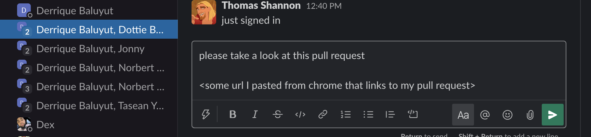
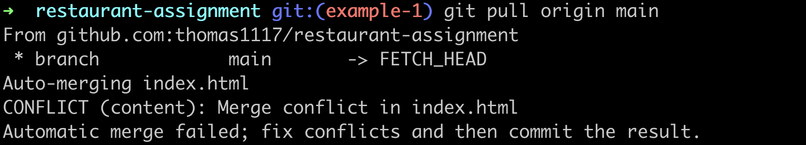
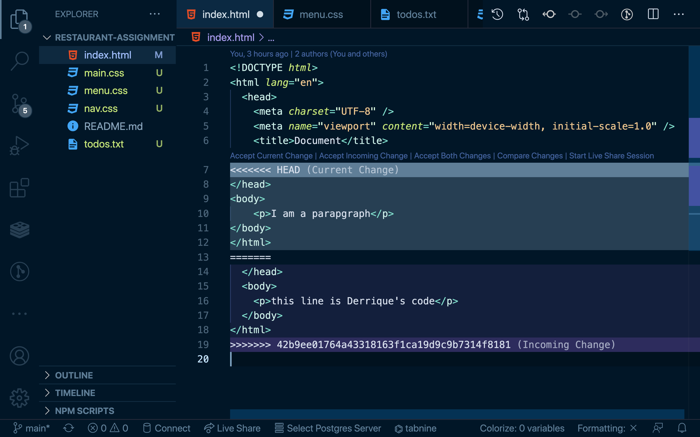

# Initial Project Start

1. Create a Repo
2. Add collaborators to project
3. Everyone clone the repo (do not fork - clone that repo to computer)
4. Make tasks/tickets for project

# Daily flow for GitHub

1. Pick a ticket from trello



2. Make a branch for that ticket from main/master
```bash
git checkout -b name-of-branch
```

3. do the task
4. push up changes to branch
```bash
git add .
git commit -m "a good description of what you did"
git push origin name-of-branch
```
5. make a pull request on github (PR) when done


6. Ask for someone to review your code (send link to PR)

7. If the person wants to check out the code
```bash
git fetch --all
git checkout name-of-branch-to-see
```
8. If the code looks good - merge the PR in github
9. Move the ticket to done
10. checkout main/master and then pull it down
```bash
git checkout main
git pull origin main
```
11. Repeat Steps 1-10

# Conflicts (when trying to merge a branch)

When you are making changes to the same file (such as index.html), conflicts are inevitable.

To Resolve a conflict...

1. From the branch that is unable to be merged

```bash
git pull origin main
```

2. Resolve the files with conflicts



3. Decide if you want to keep your code, the other persons, or both

