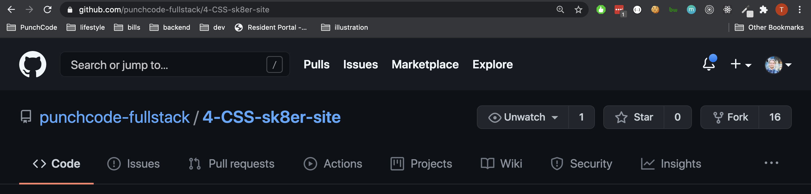
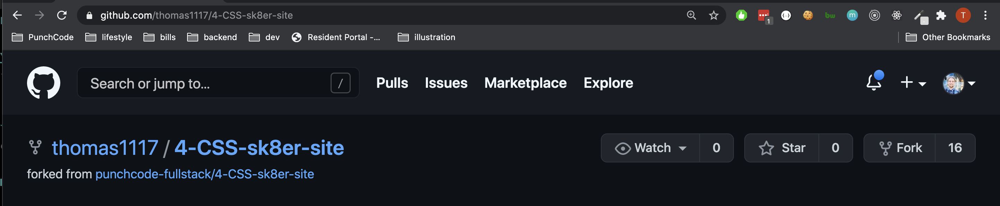
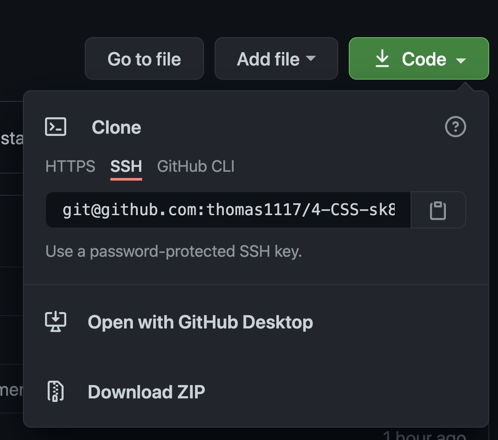

# regarding turning in assignments

# copying a class repository (fork)



- makes a copy on your profile (that has your repos)



- copy the url (aka the github remote) to your clipboard
- be sure it is marked as ssh



# add to a repository (all the commands below go in the terminal)

```bash
git add .
```

```bash
git commit -m "message"
```
# if your terminal says master
```bash
git push origin master
```

# if your terminal says main
```bash
git push origin main
```